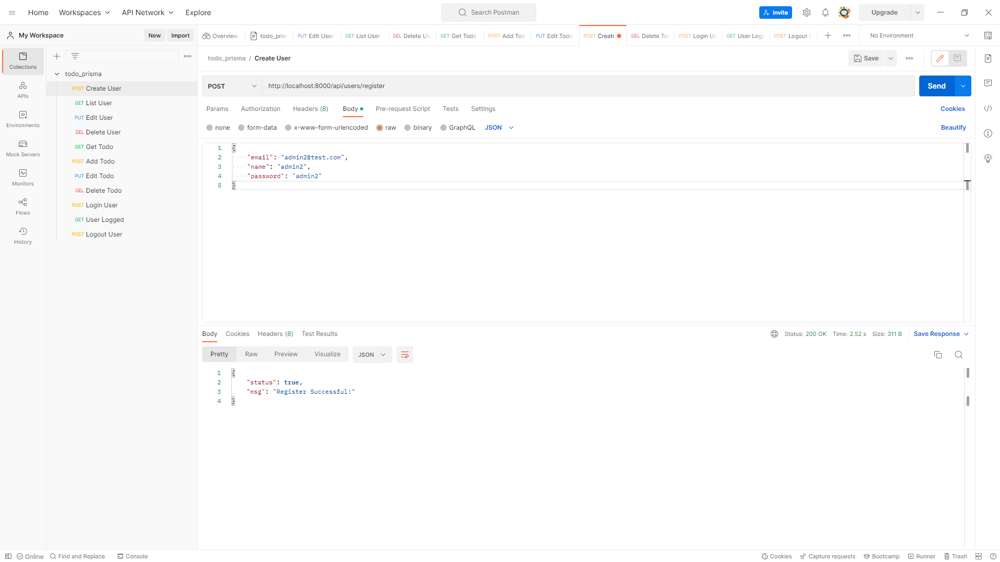
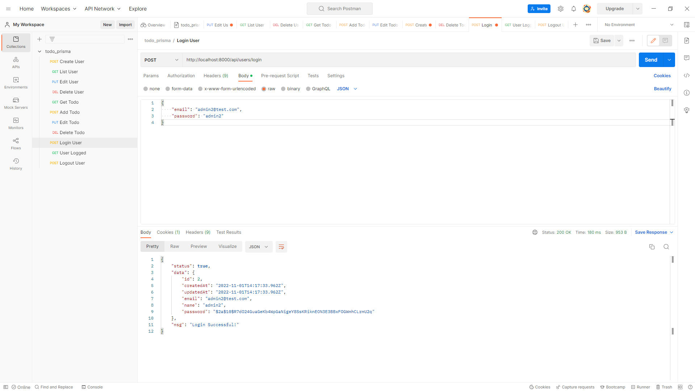
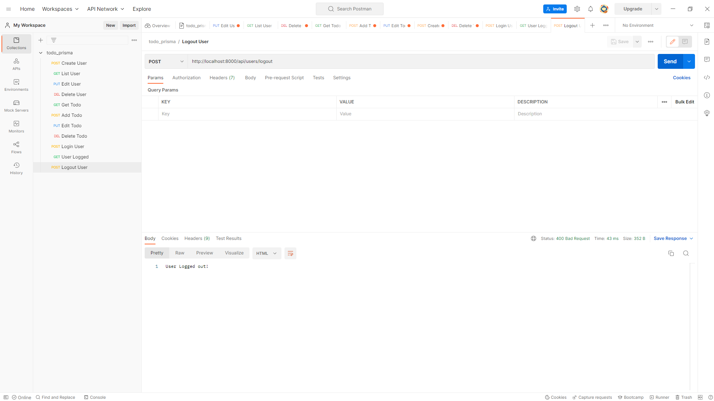
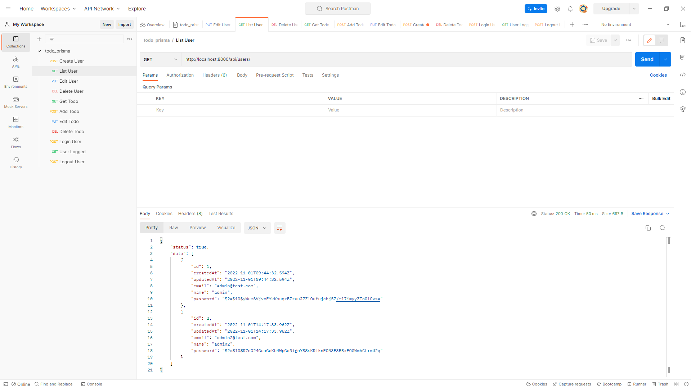
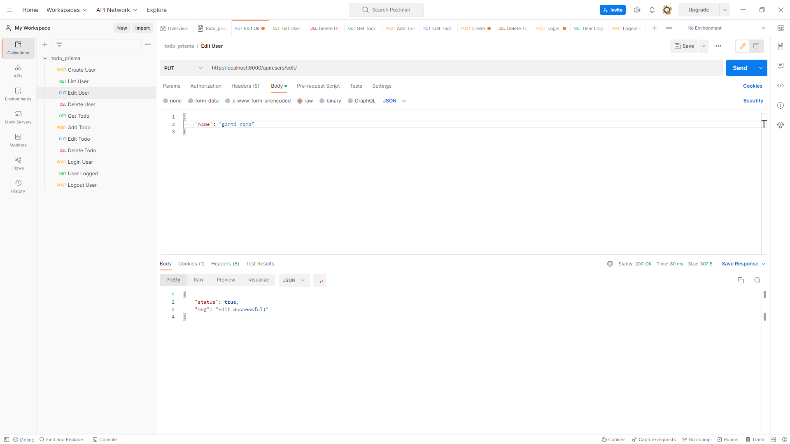
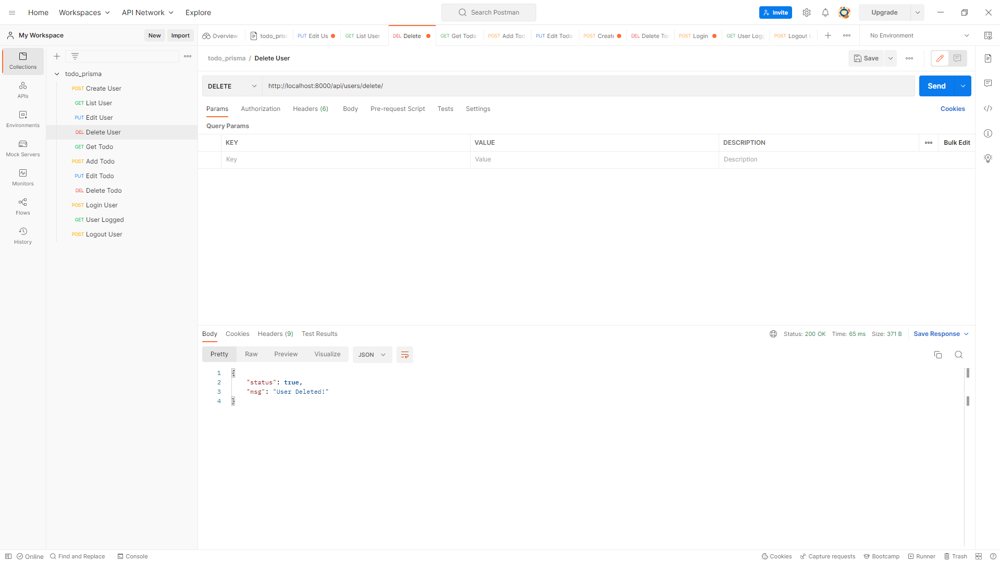
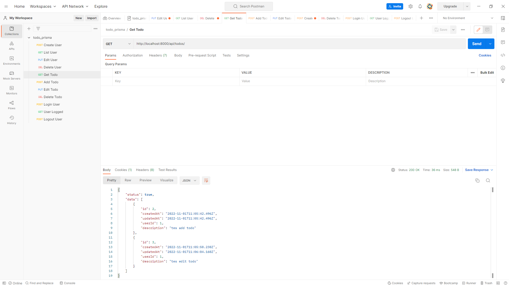
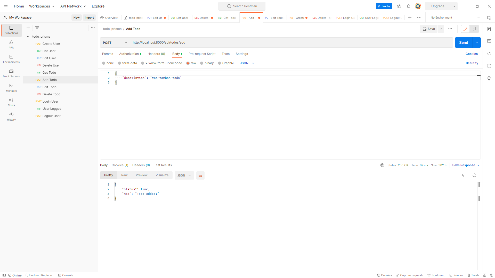

# TODO-LIST API with Prisma, Express.js, and JWT
## All Service by API
### Register User

### Login User

### If User is not logged in

### Logout User

### List User

### Edit User

### Delete User

___________________________

### List Todo

### Add Todo

### Edit Todo

### Delete Todo
